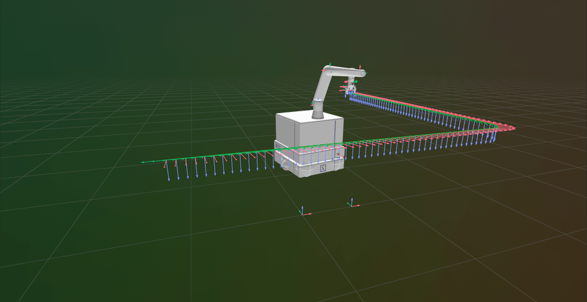
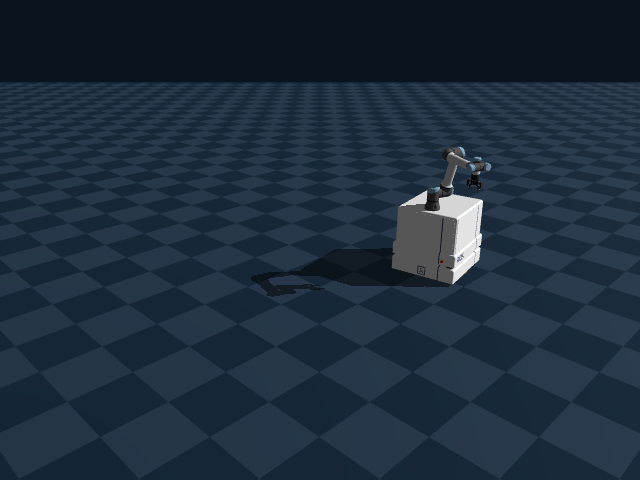
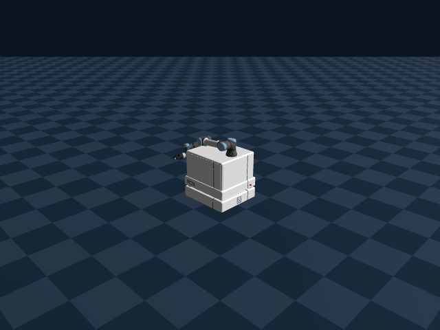

# Whole-Body Differential-Drive Trajectory Generation

Whole-body trajectory generation for a mobile manipulator: a differential-drive
base (Neobotix ROX) carrying a UR5e arm with a Robotiq gripper. Given a set of
end-effector waypoint poses in the world frame, the program produces a joint
trajectory for the whole robot — base and arm together — that tracks the
end-effector path while respecting the base's no-lateral-slip (nonholonomic)
constraint, and streams the result to the [Rerun](https://rerun.io) viewer for
3D playback.



The solved whole-body trajectory — differential-drive base and UR5e arm
tracking the end-effector path — rendered with [Rerun](https://rerun.io).
Regenerate with `python3 scripts/render_demo.py` (needs `rerun` and `ffmpeg`
on `PATH`).

## TL;DR

```bash
# 1. Install Rust (stable): https://rustup.rs
curl --proto '=https' --tlsv1.2 -sSf https://sh.rustup.rs | sh

# 2. Install the Rerun viewer (must be on PATH)
cargo install rerun-cli   # or: pip install rerun-sdk

# 3. Clone and run
git clone <this-repo-url>
cd whole_body_differential_drive_trajectory_generation
cargo run --release       # uses assets/config.yaml
```

A Rerun window opens with the robot, the end-effector path, and the solved
whole-body trajectory playing back. Edit `assets/config.yaml` (or pass your own
config: `cargo run --release -- path/to/config.yaml`) to change waypoints and
solver settings.

## How It Works

For the full math — the QP/SQP formulation, every cost and constraint term,
and the nonholonomic constraint derivation — see
[docs/solver-theory.md](docs/solver-theory.md).

The pipeline has three stages:

1. **Path interpolation** — Waypoints from `assets/config.yaml` are densified
   into `poses_per_segment` poses per segment (translation lerp, rotation
   slerp). Interior corners can be rounded with tangent circular arcs
   (`corner_radius`); see
   [docs/superpowers/specs/2026-08-14-corner-rounding-design.md](docs/superpowers/specs/2026-08-14-corner-rounding-design.md).

2. **Sequential differential IK** — Each interpolated pose is solved with a
   damped differential IK loop, one dense QP per step
   ([Clarabel](https://clarabel.org) interior-point solver). Each solve seeds
   from the previous solution so the trajectory stays continuous. The pose
   error is the SE(3) log of the goal-relative transform, and joint-space
   equality constraints (e.g. pinning the shoulder or elbow to a preferred
   configuration) can be applied to the first pose to pick a good starting
   posture. Optionally the base yaw is pinned for the first pose so the base
   x-axis points along the path.

3. **Whole-trajectory SQP** — A Gauss-Newton SQP pass over all knot
   configurations at once, warm-started from the sequential IK result, one
   dense Clarabel QP per iteration. It enforces:
   - the differential-drive **no-lateral-slip constraint**, linearized at the
     midpoint heading of each knot interval,
   - **joint velocity limits** via finite differences over `dt`,
   - **smoothness** (quadratic penalty on velocity),
   - an optional one-sided **backward-motion penalty** so the base prefers
     driving forward,
   - end-effector tracking, either **soft** (weighted cost) or **hard** (exact
     equality constraints, which may be infeasible).

   Design notes:
   [docs/superpowers/specs/2026-08-14-sqp-trajectory-optimization-design.md](docs/superpowers/specs/2026-08-14-sqp-trajectory-optimization-design.md).

After solving, the program reports **diagnostics** for both the sequential-IK
and SQP trajectories: per-knot end-effector position/orientation error and the
per-interval lateral-slip residual of the base, logged as Rerun time series
(`diagnostics/{ik,sqp}_...` on the `step` timeline) with a console summary of
the worst violations.

## Requirements

- Rust (edition 2024 — a recent stable toolchain)
- The [Rerun viewer](https://rerun.io) — the program spawns it automatically
  via `rerun::RecordingStreamBuilder::spawn()`, so the `rerun` binary must be
  on your `PATH` (e.g. `cargo install rerun-cli` or `pip install rerun-sdk`)

## Running

```bash
cargo run --release                       # uses assets/config.yaml
cargo run --release -- path/to/config.yaml
```

A Rerun viewer window opens showing the robot model, the interpolated
end-effector path with goal axes, and the solved whole-body trajectory played
back over time. The program blocks on exit until all data (including ~50 MiB
of URDF meshes) reaches the viewer.

## Genesis Simulation Demo



The same solved trajectory executed by the robot in
[Genesis](https://github.com/Genesis-Embodied-AI/Genesis): `scripts/genesis_sim.py`
runs the Rust pipeline with `WBDD_RRD_PATH` set (the same save hook
`render_demo.py` uses), reads the animated joint transforms back out of the
Rerun recording, and plays them through the diff-drive base + UR5e arm loaded
in Genesis. Playback is kinematic — the base and arm are driven along the
solved knots; there is no dynamics or controller tracking. The
[ROS Control Demo](#ros-control-demo-genesis_ros) below closes that loop: the
trajectory arrives as ROS joint commands and Genesis tracks them through its
controllers.

Genesis is a heavy pip dependency and is intentionally not part of CI. Install
it in a virtualenv (the `rerun-sdk` version must match the crate's `rerun`
version in `Cargo.toml`; a CPU PyTorch wheel is enough):

```bash
python3 -m venv .venv
.venv/bin/pip install genesis-world "rerun-sdk==0.34.1"
.venv/bin/pip install torch --index-url https://download.pytorch.org/whl/cpu

# headless: solves, simulates, and writes assets/genesis_demo.gif
.venv/bin/python scripts/genesis_sim.py

# interactive viewer instead of the offscreen capture
.venv/bin/python scripts/genesis_sim.py --viewer
```

Offscreen capture needs a Vulkan-capable GPU; without one, run with
`--viewer` on a machine with a display. The script patches a temporary copy of
the URDF (Genesis requires joint limits on the virtual planar base joints,
which carry none) and leaves `assets/rox_diff_ur5e.urdf` untouched.

## ROS Control Demo (genesis_ros)



The same solved trajectory executed through ROS instead of kinematic playback:
the trajectory is published as ROS joint commands and
[genesis_ros](https://github.com/vybhav-ibr/genesis_ros) — a third-party
Genesis/ROS 2 bridge — drives the simulated robot from them.

```
cargo run --release (WBDD_RRD_PATH=demo.rrd)
        │  solved whole-body trajectory in a Rerun recording
        ▼
scripts/wbdd_trajectory_publisher.py      ROS 2 node, reads demo.rrd,
        │  sensor_msgs/JointState on      indexes it by simulation time
        │  /wbdd/joint_commands           from /clock, and publishes
        ▼                                 base velocities + arm positions
scripts/genesis_ros_sim.py                GsRosBridge from genesis_ros:
        │                                 Genesis scene + robot per
        ▼                                 assets/genesis_ros.yaml,
Genesis simulation                        subscribes to the commands and
                                          applies them as motor targets
```

The three planar base joints are velocity-commanded and the six UR5e joints
position-commanded, per the `joint_properties` in `assets/genesis_ros.yaml`
(kp/kv gains included, tuned for this trajectory). The bridge publishes
`/clock` and `/wbdd/joint_states`; the publisher indexes the trajectory from
`/clock`, so commands stay synchronized with simulation time regardless of
how fast the simulation steps. Scene and robot setup (patched URDF, plane,
camera, trajectory loading from the recording) is shared with the kinematic
demo through `scripts/genesis_common.py`.

### Install

ROS 2 (validated on Jazzy), Genesis, and genesis_ros are all required, so the
easy route is a container: `ros:jazzy` plus the steps below. genesis_ros is
early-stage third-party code, so pin the exact commit validated here
(`c278c6eeed90b4da0586241991386dcb611799cf`) and Genesis `1.1.2` (the release
contemporaneous with that commit; its README's "tested with v0.3.5" claim is
stale, and no release builds a scene from a config without the compat shim
below).

```bash
# ROS 2 workspace with genesis_ros (pinned commit) + the compat shim
mkdir -p ~/ros2_ws/src && cd ~/ros2_ws/src
git clone https://github.com/vybhav-ibr/genesis_ros.git
cd genesis_ros
git checkout c278c6eeed90b4da0586241991386dcb611799cf
git submodule update --init --recursive
git apply <path-to-this-repo>/scripts/genesis_ros-compat.patch
cd ~/ros2_ws
rosdep install --from-paths src --ignore-src -r -y
colcon build --packages-select simulation_interfaces gs_ros_interfaces \
  gs_simulation_interfaces gs_ros
source install/setup.bash

# Python dependencies: Genesis pinned to the validated release, numpy
# downgraded afterwards for ROS 2 compatibility (genesis pulls a newer one),
# rerun-sdk matching the crate's rerun version in Cargo.toml
pip install genesis-world==1.1.2
pip install numpy==1.26.4
pip install "rerun-sdk==0.34.1" pyarrow matplotlib

# in a bare container (e.g. ros:jazzy) also:
apt-get install --no-install-recommends libglu1-mesa libgl1 libosmesa6 \
  ros-jazzy-cv-bridge
```

### Run

```bash
# 1. solve and record (in the repo root)
WBDD_RRD_PATH=demo.rrd cargo run --release

# 2. bridge: Genesis + genesis_ros, headless GIF capture
#    (add --viewer for an interactive window instead)
source ~/ros2_ws/install/setup.bash
python3 scripts/genesis_ros_sim.py --rrd demo.rrd

# 3. command stream, in a second shell with the same environment
python3 scripts/wbdd_trajectory_publisher.py --rrd demo.rrd
```

The bridge runs until the trajectory plus a short settle window has played
out in simulation time, then encodes `assets/genesis_ros_demo.gif`.

Validated end to end in a `ros:jazzy` container with Genesis on the CPU
backend (headless): the committed GIF and a topic transcript (commands vs.
simulated `/wbdd/joint_states`, arm tracking within ~0.02 rad) come from that
run. Interactive `--viewer` mode was not validated here (no display).

### Maturity caveats

- genesis_ros is early-stage: placeholder package metadata, no CI, and its
  README itself warns about Genesis version drift. Everything here is pinned
  (commit and versions above) to what was validated.
- The pinned commit cannot build a config-driven scene against any released
  Genesis (`gs.Scene` is called with option kwargs that no release accepts).
  `scripts/genesis_ros-compat.patch` filters those kwargs by the installed
  `Scene` signature; it is the only third-party change and is required.
  `assets/genesis_ros.yaml` likewise omits the `viewer_config`/`rigid_config`
  blocks whose option attributes the pinned release rejects.
- Control uses genesis_ros's direct topic interface (`JointState` on
  `/wbdd/joint_commands`), not `ros2_control` — there is no controller
  lifecycle, just PD gains applied by Genesis.
- The genesis_ros command callback consumes `position`/`velocity` arrays in
  alphabetical `joint_properties` order rather than `msg.name` order; the
  publisher packs messages to match (see `command_groups` in
  `scripts/wbdd_trajectory_publisher.py`).
- The planar base joints have no physical wheels underneath them (the URDF's
  wheel links are fixed), so the base slides on its casters; gains in
  `assets/genesis_ros.yaml` were tuned for this trajectory and scene, not
  generally.

## Configuration

Everything is driven by a YAML config (see `assets/config.yaml` for the
commented reference). Summary of the sections:

### Top level

| Key | Meaning |
|-----|---------|
| `urdf_path` | Robot URDF (default `assets/rox_diff_ur5e.urdf`) |
| `end_joint` | Joint whose child frame is the IK target (default `grasp_link_joint`) |

### `path`

| Key | Meaning |
|-----|---------|
| `waypoints` | List of `{xyz, rpy}` end-effector poses in the world frame (rpy in radians) |
| `poses_per_segment` | Interpolated poses per waypoint segment |
| `corner_radius` | Radius (m) of tangent arcs rounding interior corners; `0` leaves corners sharp; clamped per corner to fit |
| `solve_first_pose_only` | Debug: solve only the first pose (skips the SQP pass) |
| `align_first_pose_base_yaw` | Pin base yaw for the first pose so the base faces along the path |

### `differential_ik`

| Key | Meaning |
|-----|---------|
| `num_steps` | Max IK iterations per pose |
| `damping_factor` | Damping on the QP step |
| `convergence_threshold` | Pose-error norm at which the loop stops |
| `equality_constraints` | `{joint_name, target_value}` pins, applied to the **first pose only** |

### `trajectory`

| Key | Meaning |
|-----|---------|
| `enabled` | Toggle the SQP pass |
| `dt` | Time between knots (s), used for velocity limits |
| `ee_tracking` | `soft` (weighted cost) or `hard` (exact, may be infeasible) |
| `ee_weight` | End-effector tracking weight (soft mode) |
| `smoothness_weight` | Quadratic velocity penalty weight |
| `backward_weight` | One-sided penalty on backward base motion; `0` allows reversing |
| `max_joint_velocity` | Per-joint velocity limit (rad/s or m/s) |
| `sqp_max_iterations` | Max Gauss-Newton iterations |
| `trust_region` | Per-iteration step bound |
| `convergence_step_norm` | Step norm at which SQP stops |
| `damping` | Levenberg-style regularization on the QP Hessian |
| `base_joint_names` | Names of the planar base joints `[x, y, yaw]` |

## Project Layout

```
src/
  main.rs           # binary: load config, run the pipeline, log to Rerun
  lib.rs            # library crate `wbdd` (flat public API via re-exports)
  configs.rs        # config structs + YAML parsing + path interpolation
  kinematics.rs     # k-based FK/Jacobians, SE(3) log, differential IK loop
  qp.rs             # generic dense convex QP wrapper over Clarabel
  diagnostics.rs    # pose-tracking error + nonholonomic slip residuals
  trajectory.rs     # Gauss-Newton SQP whole-trajectory optimizer
  visualization.rs  # Rerun logging (URDF, path, goal axes, trajectory)
assets/
  config.yaml       # reference configuration
  genesis_ros.yaml  # scene/robot/control config for the ROS control demo
  rox_diff_ur5e.urdf# ROX base + UR5e + Robotiq gripper, with a planar
                    # (x, y, yaw) joint stack connecting world to base
  meshes/           # visual + collision meshes
docs/
  solver-theory.md               # the math: QP, SQP, nonholonomic constraint
  qp-sqp-solver-crates.md        # solver crate survey
  rust-best-practices.md         # Rust conventions for this repo
  superpowers/specs/             # design docs (corner rounding, SQP)
scripts/
  render_demo.py                 # regenerates assets/demo.gif headlessly
  genesis_common.py              # shared URDF/trajectory helpers for the
                                 # Genesis demos
  genesis_sim.py                 # plays the trajectory in Genesis, regenerates
                                 # assets/genesis_demo.gif headlessly
  genesis_ros_sim.py             # genesis_ros bridge entrypoint for the ROS
                                 # control demo (assets/genesis_ros_demo.gif)
  wbdd_trajectory_publisher.py   # publishes the solved trajectory as ROS
                                 # joint commands for the control demo
```

The mobile base is modeled with three planar joints
(`world_base_link_planar_prismatic_x`, `world_base_link_planar_prismatic_y`,
`world_base_link_planar_yaw`) so the whole robot is a single kinematic chain;
the differential-drive constraint is imposed by the optimizer rather than the
model.

## Development

```bash
cargo fmt
cargo check --all-targets   # plain `check` skips #[cfg(test)] code
cargo test
```

The crate builds warning-clean. Contributor conventions live in
[AGENTS.md](AGENTS.md).

## Dependencies

| Crate | Role |
|-------|------|
| [`k`](https://crates.io/crates/k) | Kinematics: URDF chain, FK, Jacobians (nalgebra-based) |
| [`clarabel`](https://crates.io/crates/clarabel) | Interior-point convex QP solver |
| [`rerun`](https://crates.io/crates/rerun) | 3D visualization and trajectory playback |
| `serde` / `serde_yaml_ng` | YAML config parsing |
